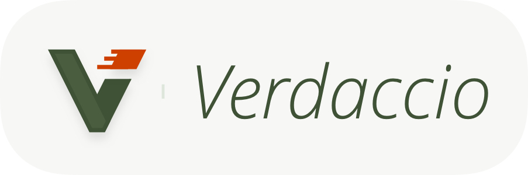

// VARIABLES FREQUENTLY CHANGED
:revnumber: 1.0.0

// ASCIIDOCTOR VARIABLES
:author: Alvin Berthelot
:email: alvin.berthelot@webyousoon.com
:source-highlighter: coderay
:title-logo-image: 
:icons: font
:doctype: book
:compat-mode:
:experimental:
:pygments-style: bw

// CUSTOM VARIABLES
:nameRepository: slides-node-js
:urlRepository: https://github.com/alvinberthelot/slides-node-js

= Verdaccio
{author}

<<<
include::intro-license.adoc[]

<<<
include::content/partials/node-js-npm-concise.adoc[]

<<<
include::content/partials/node-js-npm-bottleneck.adoc[]

<<<
include::content/partials/node-js-npm-verdaccio.adoc[]

<<<
include::license.adoc[]